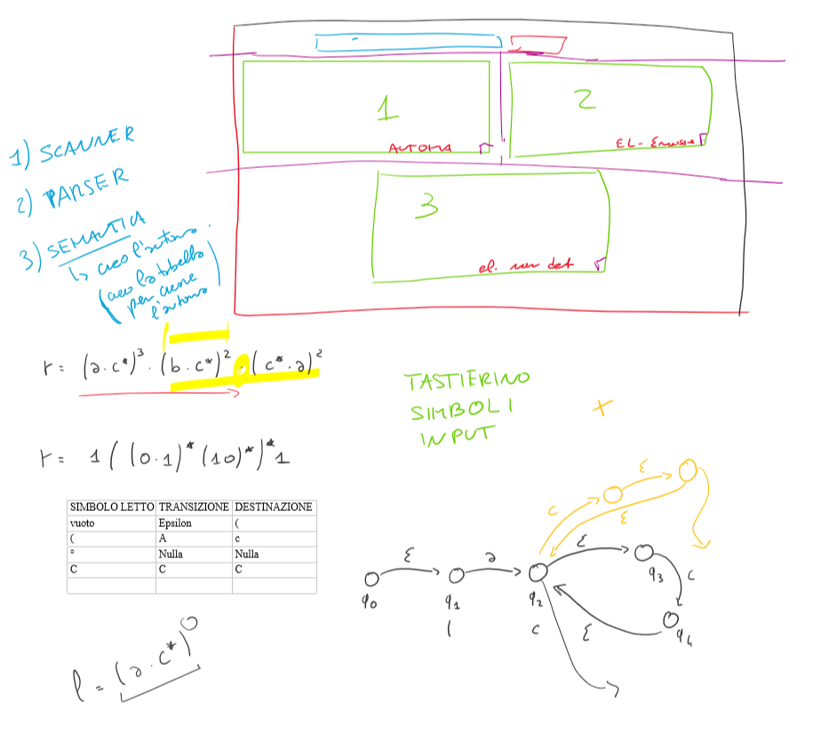

#  PROGETTO Linguaggi Formali e Compilatori
## PARSER ESPRESSIONI REGOLARI

	- OBIETTIVO
		○ Presa in input una re, creare l'automa relativo e risolverlo (eliminare ε-mosse e non determinismo)

	- INPUT 
		○ Espressione regolare
		
	- OUTPUT
		○ Automa e risoluzione

### PATTERN DI SVILUPPO
MVC:
* MODEL: gestisce le stringhe.
	- gestisce inserimento simboli da tastierino presente nell'UI.
	- SCANNER, PARSER E SEMANTICA
		- scanner controlla caratteri
		- parser controlla la sintassi
		- viene gestita poi la semantica, si crea quindi l'automa (non graficamente) e lo si risolve.
* CONTROLLER: utente che utilizza l'interfaccia grafica, inserisce l'espressione regolare e preme pulsante che avvia la gestione della stringa da parte del model.
* VIEW: visualizza l'interfaccia grafica con cui l'utente interagisce.

